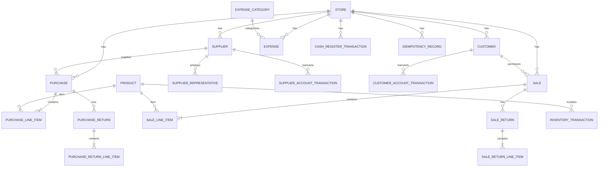

# Data Model: Phase 3 — Business Operations

## Entity-Relationship Diagram

---

## 1. Domain Entities & Attributes

### `Supplier`
Inherits: `SoftDeletableEntity`, `ITenantEntity`
- `Id`: `Guid` (PK)
- `StoreId`: `Guid` (FK `Store`)
- `Name`: `string(100)` (Required, Unique per store via `LOWER(name)`)
- `Phone`: `string(30)` (Required)
- `Address`: `string(255)` (Optional)
- `Notes`: `string(500)` (Optional)
- `IsActive`: `bool` (Default: `true`)
- `DeletedAt`: `DateTimeOffset?`

### `SupplierRepresentative`
Inherits: `SoftDeletableEntity`, `ITenantEntity`
- `Id`: `Guid` (PK)
- `StoreId`: `Guid` (FK `Store`)
- `SupplierId`: `Guid` (FK `Supplier`)
- `Name`: `string(100)` (Required)
- `Phone`: `string(30)` (Required)
- `Notes`: `string(500)` (Optional)
- `IsActive`: `bool` (Default: `true`)

### `Customer`
Inherits: `SoftDeletableEntity`, `ITenantEntity`
- `Id`: `Guid` (PK)
- `StoreId`: `Guid` (FK `Store`)
- `Name`: `string(100)` (Required)
- `Phone`: `string(30)` (Required)
- `Address`: `string(255)` (Optional)
- `CreditLimit`: `decimal?` (`numeric(19,4)`, Optional)
- `Notes`: `string(500)` (Optional)
- `IsActive`: `bool` (Default: `true`)
- `DeletedAt`: `DateTimeOffset?`

### `SupplierAccountTransaction`
Inherits: `BaseEntity`, `ITenantEntity` (Append-only Ledger)
- `Id`: `Guid` (PK)
- `StoreId`: `Guid` (FK `Store`)
- `SupplierId`: `Guid` (FK `Supplier`)
- `Type`: `SupplierTransactionType` (`OpeningBalance`, `Purchase`, `Payment`, `PurchaseReturn`, `Adjustment`)
- `Amount`: `decimal` (`numeric(19,4)`) — Positive increases payable balance, negative decreases
- `ReferenceId`: `Guid?` (FK to Purchase, Payment, or PurchaseReturn)
- `Notes`: `string(500)` (Optional)
- `CreatedBy`: `Guid` (FK `User`)

### `CustomerAccountTransaction`
Inherits: `BaseEntity`, `ITenantEntity` (Append-only Ledger)
- `Id`: `Guid` (PK)
- `StoreId`: `Guid` (FK `Store`)
- `CustomerId`: `Guid` (FK `Customer`)
- `Type`: `CustomerTransactionType` (`OpeningBalance`, `Sale`, `Payment`, `SaleReturn`, `Adjustment`)
- `Amount`: `decimal` (`numeric(19,4)`) — Positive increases receivable balance, negative decreases
- `ReferenceId`: `Guid?` (FK to Sale, Payment, or SaleReturn)
- `Notes`: `string(500)` (Optional)
- `CreatedBy`: `Guid` (FK `User`)

### `Purchase`
Inherits: `SoftDeletableEntity`, `ITenantEntity`
- `Id`: `Guid` (PK)
- `StoreId`: `Guid` (FK `Store`)
- `SupplierId`: `Guid` (FK `Supplier`)
- `PurchaseNumber`: `string(50)` (Required, Unique per store)
- `InvoiceNumber`: `string(50)` (Optional, Supplier's invoice #)
- `PurchaseDate`: `DateTimeOffset` (Required)
- `Status`: `PurchaseStatus` (`Draft`, `Confirmed`)
- `TotalAmount`: `decimal` (`numeric(19,4)`)
- `Notes`: `string(500)` (Optional)
- `CreatedBy`: `Guid` (FK `User`)

### `PurchaseLineItem`
Inherits: `BaseEntity`, `ITenantEntity`
- `Id`: `Guid` (PK)
- `StoreId`: `Guid` (FK `Store`)
- `PurchaseId`: `Guid` (FK `Purchase`)
- `ProductId`: `Guid` (FK `Product`)
- `Quantity`: `decimal` (`numeric(19,4)`)
- `UnitCost`: `decimal` (`numeric(19,6)`)
- `Discount`: `decimal` (`numeric(19,4)`, Default: `0`)
- `SubTotal`: `decimal` (`numeric(19,4)`)

### `PurchaseReturn`
Inherits: `BaseEntity`, `ITenantEntity`
- `Id`: `Guid` (PK)
- `StoreId`: `Guid` (FK `Store`)
- `PurchaseId`: `Guid` (FK `Purchase`)
- `ReturnNumber`: `string(50)` (Required, Unique per store)
- `ReturnDate`: `DateTimeOffset` (Required)
- `TotalAmount`: `decimal` (`numeric(19,4)`)
- `Reason`: `string(500)` (Required)
- `CreatedBy`: `Guid` (FK `User`)

### `PurchaseReturnLineItem`
Inherits: `BaseEntity`, `ITenantEntity`
- `Id`: `Guid` (PK)
- `StoreId`: `Guid` (FK `Store`)
- `PurchaseReturnId`: `Guid` (FK `PurchaseReturn`)
- `ProductId`: `Guid` (FK `Product`)
- `Quantity`: `decimal` (`numeric(19,4)`)
- `UnitCost`: `decimal` (`numeric(19,6)`)
- `SubTotal`: `decimal` (`numeric(19,4)`)

### `Sale`
Inherits: `SoftDeletableEntity`, `ITenantEntity`
- `Id`: `Guid` (PK)
- `StoreId`: `Guid` (FK `Store`)
- `CustomerId`: `Guid?` (FK `Customer`, Nullable for walk-in cash sales)
- `InvoiceNumber`: `string(50)` (Required, Unique per store)
- `SaleDate`: `DateTimeOffset` (Required)
- `Status`: `SaleStatus` (`Completed`, `Voided`)
- `PaymentMethod`: `SalePaymentMethod` (`Cash`, `Credit`, `Mixed`)
- `SubTotal`: `decimal` (`numeric(19,4)`)
- `DiscountAmount`: `decimal` (`numeric(19,4)`, Default: `0`)
- `TaxAmount`: `decimal` (`numeric(19,4)`, Default: `0`)
- `TotalAmount`: `decimal` (`numeric(19,4)`)
- `CashAmount`: `decimal` (`numeric(19,4)`, Default: `0`)
- `CreditAmount`: `decimal` (`numeric(19,4)`, Default: `0`)
- `TotalCost`: `decimal` (`numeric(19,4)`) — Total COGS calculated via WAC
- `EtaUuid`: `string?` (Deferred placeholder)
- `SubmissionStatus`: `string?` (Deferred placeholder)
- `Notes`: `string(500)` (Optional)
- `CreatedBy`: `Guid` (FK `User`)

### `SaleLineItem`
Inherits: `BaseEntity`, `ITenantEntity`
- `Id`: `Guid` (PK)
- `StoreId`: `Guid` (FK `Store`)
- `SaleId`: `Guid` (FK `Sale`)
- `ProductId`: `Guid` (FK `Product`)
- `Quantity`: `decimal` (`numeric(19,4)`)
- `UnitPrice`: `decimal` (`numeric(19,4)`)
- `UnitCost`: `decimal` (`numeric(19,6)`) — WAC at time of sale
- `Discount`: `decimal` (`numeric(19,4)`, Default: `0`)
- `SubTotal`: `decimal` (`numeric(19,4)`)
- `TotalCost`: `decimal` (`numeric(19,4)`) — `Quantity * UnitCost`

### `SaleReturn`
Inherits: `BaseEntity`, `ITenantEntity`
- `Id`: `Guid` (PK)
- `StoreId`: `Guid` (FK `Store`)
- `SaleId`: `Guid` (FK `Sale`)
- `ReturnNumber`: `string(50)` (Required, Unique per store)
- `ReturnDate`: `DateTimeOffset` (Required)
- `TotalAmount`: `decimal` (`numeric(19,4)`)
- `TotalCost`: `decimal` (`numeric(19,4)`) — Reversal of COGS
- `RefundMethod`: `RefundMethod` (`Cash`, `Credit`)
- `Reason`: `string(500)` (Required)
- `CreatedBy`: `Guid` (FK `User`)

### `SaleReturnLineItem`
Inherits: `BaseEntity`, `ITenantEntity`
- `Id`: `Guid` (PK)
- `StoreId`: `Guid` (FK `Store`)
- `SaleReturnId`: `Guid` (FK `SaleReturn`)
- `ProductId`: `Guid` (FK `Product`)
- `Quantity`: `decimal` (`numeric(19,4)`)
- `UnitPrice`: `decimal` (`numeric(19,4)`)
- `UnitCost`: `decimal` (`numeric(19,6)`) — Exact original unit cost from `SaleLineItem`
- `SubTotal`: `decimal` (`numeric(19,4)`)
- `TotalCost`: `decimal` (`numeric(19,4)`)

### `Payment`
Inherits: `BaseEntity`, `ITenantEntity`
- `Id`: `Guid` (PK)
- `StoreId`: `Guid` (FK `Store`)
- `PartyType`: `PaymentPartyType` (`Customer`, `Supplier`)
- `CustomerId`: `Guid?` (FK `Customer`)
- `SupplierId`: `Guid?` (FK `Supplier`)
- `Amount`: `decimal` (`numeric(19,4)`)
- `PaymentDate`: `DateTimeOffset` (Required)
- `PaymentMethod`: `PaymentMethod` (`Cash`, `BankTransfer`)
- `ReferenceNumber`: `string(50)?`
- `Notes`: `string(500)?`
- `CreatedBy`: `Guid` (FK `User`)

### `ExpenseCategory`
Inherits: `SoftDeletableEntity`, `ITenantEntity`
- `Id`: `Guid` (PK)
- `StoreId`: `Guid` (FK `Store`)
- `Name`: `string(100)` (Required, Unique per store via `LOWER(name)`)
- `Description`: `string(500)?`
- `IsActive`: `bool` (Default: `true`)

### `Expense`
Inherits: `SoftDeletableEntity`, `ITenantEntity`
- `Id`: `Guid` (PK)
- `StoreId`: `Guid` (FK `Store`)
- `CategoryId`: `Guid` (FK `ExpenseCategory`)
- `Amount`: `decimal` (`numeric(19,4)`)
- `ExpenseDate`: `DateTimeOffset` (Required)
- `PaymentMethod`: `PaymentMethod` (`Cash`, `BankTransfer`)
- `Description`: `string(500)?`
- `CreatedBy`: `Guid` (FK `User`)

### `CashRegisterTransaction`
Inherits: `BaseEntity`, `ITenantEntity` (Append-only Ledger)
- `Id`: `Guid` (PK)
- `StoreId`: `Guid` (FK `Store`)
- `Type`: `CashTransactionType` (`OpeningFloat`, `CashSale`, `CashPaymentIn`, `CashPaymentOut`, `CashExpense`, `CashWithdrawal`, `CashAdjustment`)
- `Amount`: `decimal` (`numeric(19,4)`)
- `ReferenceId`: `Guid?`
- `Notes`: `string(500)?`
- `CreatedBy`: `Guid` (FK `User`)

### `IdempotencyRecord`
Inherits: `BaseEntity`, `ITenantEntity`
- `Id`: `Guid` (PK)
- `StoreId`: `Guid` (FK `Store`)
- `Key`: `string(128)` (Unique per store with `Key`)
- `Endpoint`: `string(256)`
- `Status`: `IdempotencyStatus` (`Pending`, `Completed`)
- `ResponseCode`: `int?`
- `ResponseBody`: `string?`
- `ExpiresAt`: `DateTimeOffset`
