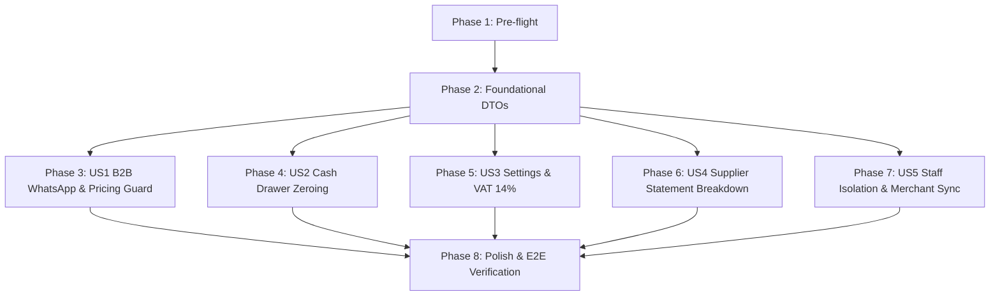

# Tasks: Operations Hardening & Business Workflow Fixes

**Branch**: `013-operations-fixes-hardening` | **Date**: 2026-09-10 | **Plan**: [plan.md](./plan.md)

---

## Phase 1: Setup & Pre-flight Verification

**Purpose**: Verify working tree state and baseline build before making modifications

- [ ] T001 Verify backend builds cleanly via `dotnet build` in `src/RetailOS.Api`
- [ ] T002 [P] Verify frontend TypeScript types and compilation in `g:\system-analysiss-saas\system-FE`

---

## Phase 2: Foundational (Contracts & Shared Types)

**Purpose**: Core DTO updates and shared interfaces required across user stories

- [ ] T003 Update `CashRegisterCloseResponse` in `src/RetailOS.Application/CashRegister/DTOs/CashRegisterDTOs.cs` to include `SweepAmount`
- [ ] T004 [P] Update `AccountStatementItemResponse` in `src/RetailOS.Application/Suppliers/DTOs/SupplierDTOs.cs` with invoice summary fields

**Checkpoint**: Core DTOs and signatures ready for service implementations.

---

## Phase 3: User Story 1 - B2B Wholesale WhatsApp Sync & Below-Cost Price Safeguard (Priority: P1) 🎯 MVP

**Goal**: Prevent loss-making wholesale price adjustments below cost and guarantee WhatsApp notifications reflect real-time order status.

**Independent Test**:
1. In `B2BOrderDetailsModal.tsx`, verify WhatsApp button generates URL with real status and amount.
2. Verify setting a price lower than `item.purchaseCost` is blocked in frontend and backend throws `PRICE_BELOW_COST`.

### Implementation for User Story 1:
- [ ] T005 [US1] Fix WhatsApp URL generation inside `B2BOrderDetailsModal.tsx` by passing `order.status`, `order.totalAmount`, and `order.paymentPreference` to `buildOrderWhatsAppUrl` in `g:\system-analysiss-saas\system-FE\src\features\b2b\components\B2BOrderDetailsModal.tsx`
- [ ] T006 [P] [US1] Change default fallback status in `whatsappUtils.ts` from 'مرفوض' to 'قيد المراجعة' in `g:\system-analysiss-saas\system-FE\src\features\b2b\utils\whatsappUtils.ts`
- [ ] T007 [US1] Enforce `PRICE_BELOW_COST` domain guard in `B2BOrderService.ApproveOrderAsync` rejecting any unit price `< item.PurchaseCost` in `src/RetailOS.Infrastructure/B2B/B2BOrderService.cs`
- [ ] T008 [US1] Add client-side validation, minimum price constraints (`min={item.purchaseCost}`), and warning badges in `g:\system-analysiss-saas\system-FE\src\features\b2b\components\B2BOrderDetailsModal.tsx`

**Checkpoint**: B2B order modal displays correct status via WhatsApp and strictly rejects below-cost pricing.

---

## Phase 4: User Story 2 - End-of-Shift Cash Drawer Settlement & Sweep to Safe (Priority: P1)

**Goal**: Ensure closing a shift settles any discrepancy, sweeps remaining drawer cash out to the safe, and zeros out the drawer balance (`0.00 EGP`).

**Independent Test**:
1. Open register with positive balance, submit shift close with counted amount.
2. Confirm discrepancy adjustment is logged and drawer sweep transaction zeroes the drawer balance.

### Implementation for User Story 2:
- [ ] T009 [US2] Update `CloseRegisterAsync` in `CashRegisterService.cs` to add a closing `CashDrop` sweep for `-request.CountedAmount` in `src/RetailOS.Infrastructure/Operations/CashRegisterService.cs`
- [ ] T010 [US2] Update `CloseRegisterModal.tsx` to display cash sweep confirmation and notify user of drawer zeroing in `g:\system-analysiss-saas\system-FE\src\features\expenses\components\CloseRegisterModal.tsx`
- [ ] T011 [US2] Ensure dashboard cash register summary query accounts for closing sweep in `src/RetailOS.Infrastructure/Operations/DashboardService.cs`

**Checkpoint**: Cash drawer is strictly zeroed upon closing, ready for a fresh opening float.

---

## Phase 5: User Story 3 - Store Settings Instant Toggle & VAT 14% Application (Priority: P2)

**Goal**: Make store setting toggles persist immediately upon click, and apply 14% VAT to POS sales when enabled.

**Independent Test**:
1. Toggle VAT in Store Settings; verify instant persistence across reload.
2. Complete a POS sale; verify 14% VAT is calculated and stored in `Sale.TaxAmount`.

### Implementation for User Story 3:
- [ ] T012 [US3] Implement immediate auto-save on toggle switches (`TaxEnabled`, `AllowNegativeStock`) with toast feedback in `g:\system-analysiss-saas\system-FE\src\features\settings\components\StoreProfileTab.tsx`
- [ ] T013 [US3] Calculate and record `TaxAmount = SubTotal * 0.14` and update `TotalAmount` in `SaleService.CreateSaleAsync` when `store.TaxEnabled` is true in `src/RetailOS.Infrastructure/Operations/SaleService.cs`
- [ ] T014 [US3] Display 14% VAT breakdown in POS checkout summary and invoice printing when store tax is enabled in `g:\system-analysiss-saas\system-FE\src\pages\POS.tsx`

**Checkpoint**: Store settings persist reliably, and VAT 14% is accurately calculated when toggled ON.

---

## Phase 6: User Story 4 - Supplier Account Statement with Purchase Breakdown (Priority: P2)

**Goal**: Allow viewing complete purchase invoice line items directly within the supplier account statement modal.

**Independent Test**:
1. Open a supplier account statement with purchase transactions.
2. Click "عرض تفاصيل الفاتورة" on a purchase row; verify line items and costs are rendered.

### Implementation for User Story 4:
- [ ] T015 [US4] Add purchase invoice details drill-down button and expandable drawer/accordion in `g:\system-analysiss-saas\system-FE\src\features\suppliers\components\SupplierStatementModal.tsx`
- [ ] T016 [US4] Leverage `/api/purchases/{id}` to fetch and render invoice line items (product, qty, unit cost, subtotal) on demand in `g:\system-analysiss-saas\system-FE\src\features\suppliers\components\SupplierStatementModal.tsx`

**Checkpoint**: Supplier statement provides full invoice item transparency for accounting audit.

---

## Phase 7: User Story 5 - Store Staff User Isolation & Merchant Account Synchronization (Priority: P2)

**Goal**: Exclude wholesale merchants from Store Settings Users list and synchronize user account deactivation when a merchant is deactivated.

**Independent Test**:
1. Open Store Settings -> Users; confirm merchants do not appear in the staff list.
2. Deactivate a merchant; verify merchant's login is immediately blocked.

### Implementation for User Story 5:
- [ ] T017 [US5] Filter out `Role == Roles.Merchant` in `UserService.GetUsersAsync` in `src/RetailOS.Infrastructure/Users/UserService.cs`
- [ ] T018 [US5] Update `MerchantService.ToggleActiveAsync` to synchronously update linked `User.IsActive` in `src/RetailOS.Infrastructure/B2B/MerchantService.cs`

**Checkpoint**: Staff management is clean and merchant deactivation immediately secures the wholesale portal.

---

## Phase 8: Polish, Build & End-to-End Verification

**Purpose**: Full compilation, API restart, and end-to-end verification across all 5 workflows.

- [ ] T019 Run `dotnet build` to ensure zero compilation warnings or errors across the backend solution
- [ ] T020 Run `dotnet run --project src/RetailOS.Api` in background to start API on port 5030
- [ ] T021 Execute full verification walkthrough following `quickstart.md` across all 5 modules
- [ ] T022 Commit and push changes to GitHub repository `https://github.com/khedrfarrag/ERPsystem-BE.git`

---

## Dependencies & Execution Order

### Parallel Opportunities
- `T005` (FE WhatsApp) & `T007` (BE Price Guard) can be implemented in parallel.
- `T009` (BE Cash Drawer) & `T012` (FE Settings Auto-save) operate on distinct files.
- `T015` (FE Supplier Modal) & `T017` (BE User Isolation) operate on distinct subsystems.
