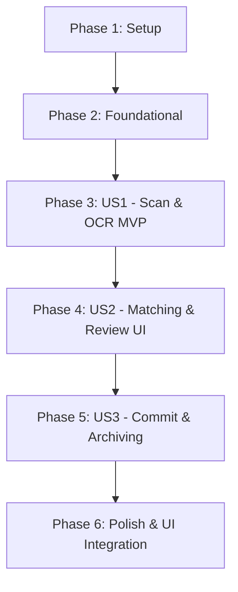

# Tasks: AI Invoice Scanner

**Feature**: AI Invoice Scanner via Google Gemini Pro  
**Specification**: [spec.md](./spec.md) | **Plan**: [plan.md](./plan.md)  
**Status**: Ready for Implementation  

---

## Phase 1: Setup & Shared Infrastructure

**Purpose**: Project configuration, entity updates, and DTO contracts

- [X] T001 Register Gemini API configuration in `src/RetailOS.Api/appsettings.json` and `src/RetailOS.Api/appsettings.Development.json`
- [X] T002 [P] Update domain entities: Add `InvoiceImageUrl` to `src/RetailOS.Domain/Entities/Purchase.cs` and `EnableInvoiceArchiving` to `src/RetailOS.Domain/Entities/Store.cs`
- [X] T003 [P] Define application DTOs and contracts in `src/RetailOS.Application/Ai/DTOs/AiInvoiceDtos.cs` and `src/RetailOS.Application/Ai/Interfaces/IAiInvoiceScannerService.cs`

---

## Phase 2: Foundational (Blocking Prerequisites)

**Purpose**: Core services and utilities that MUST be completed before User Stories

**⚠️ CRITICAL**: No user story work can begin until this phase is complete

- [X] T004 Implement `PricingCalculator` helper with 2-decimal commercial rounding and zero/negative cost guards in `src/RetailOS.Application/Common/Helpers/PricingCalculator.cs`
- [X] T005 [P] Implement `IInvoiceStorageService` and `LocalFileInvoiceStorageService` supporting WebP compression in `src/RetailOS.Infrastructure/Storage/InvoiceStorageService.cs`
- [X] T006 [P] Implement `GeminiClient` utilizing `HttpClientFactory` and Gemini Structured Output Schema (`response_schema`) in `src/RetailOS.Infrastructure/Ai/GeminiClient.cs`
- [X] T007 Register AI services, typed HTTP client, and storage services in `src/RetailOS.Infrastructure/DependencyInjection.cs`

**Checkpoint**: Foundation ready - user story implementation can now proceed

---

## Phase 3: User Story 1 - Scan & Digitize Invoice via Photo/PDF (Priority: P1) 🎯 MVP

**Goal**: Store Owner or Manager can upload an invoice image or PDF and extract structured data via Gemini Vision

**Independent Test**: Upload a test invoice photo to `POST /api/ai/invoices/scan` and verify structured JSON is returned within 5 seconds with accurate item descriptions, prices, and quantities.

- [X] T008 [US1] Implement `AiInvoiceScannerService.ScanAndExtractAsync` to parse images/PDFs with Gemini Vision in `src/RetailOS.Infrastructure/Ai/AiInvoiceScannerService.cs`
- [X] T009 [US1] Implement `AiInvoiceController.ScanInvoice` endpoint (`POST /api/ai/invoices/scan`) with 10MB limit and auth checks in `src/RetailOS.Api/Controllers/AiInvoiceController.cs`
- [X] T010 [P] [US1] Create frontend TypeScript types in `system-FE/src/features/ai-scanner/types/ai-invoice.types.ts`
- [X] T011 [P] [US1] Implement React Query mutations for scanning in `system-FE/src/features/ai-scanner/api/useAiInvoiceMutations.ts`
- [X] T012 [US1] Build upload dropzone and camera capture component in `system-FE/src/features/ai-scanner/components/InvoiceDropzone.tsx`

**Checkpoint**: User Story 1 (MVP) is functional and testable independently

---

## Phase 4: User Story 2 - Smart Catalog Matching & Human Verification (Priority: P1)

**Goal**: Interactive verification grid showing scanned items alongside matching store products with live editing and edge-case guards

**Independent Test**: Verify that scanned items matching existing store products display the "صنف موجود" badge, new items display "صنف جديد", global markup recalculates retail prices, and cost=0/loss warnings trigger visually.

- [X] T013 [US2] Implement 3-tier product reconciliation engine (`AiInvoiceMatchingService`) with barcode, exact name, and fuzzy matching in `src/RetailOS.Infrastructure/Ai/AiInvoiceMatchingService.cs`
- [X] T014 [US2] Connect matching engine and `PricingCalculator` (default 25% markup) to the scan output pipeline in `src/RetailOS.Infrastructure/Ai/AiInvoiceScannerService.cs`
- [X] T015 [P] [US2] Build `InvoiceImagePreview.tsx` for side-by-side or collapsible zoomable receipt view in `system-FE/src/features/ai-scanner/components/InvoiceImagePreview.tsx`
- [X] T016 [US2] Build `InvoiceItemsReviewTable.tsx` featuring global markup header input, inline cell editing, cost=0 highlighting, and loss warnings in `system-FE/src/features/ai-scanner/components/InvoiceItemsReviewTable.tsx`
- [X] T017 [US2] Assemble main `AiInvoiceScanModal.tsx` review modal with live totals recalculation in `system-FE/src/features/ai-scanner/components/AiInvoiceScanModal.tsx`

**Checkpoint**: User Stories 1 & 2 are both fully functional and testable

---

## Phase 5: User Story 3 - Commit to Inventory & Purchases or Direct Catalog Import (Priority: P2)

**Goal**: Commit verified invoice either as an official Purchase with stock increase or as Catalog Import, with duplicate detection and digital archiving

**Independent Test**: Commit a verified invoice in "Purchase" mode and verify that `Purchase` and `PurchaseLineItem` records are created, inventory is incremented via `InventoryTransaction`, duplicate invoices trigger warnings, and the image is archived when enabled.

- [X] T018 [US3] Implement `InvoiceVerificationService` for duplicate detection and 100% identical invoice guardrails in `src/RetailOS.Infrastructure/Ai/InvoiceVerificationService.cs`
- [X] T019 [US3] Implement `AiInvoiceCommitService.CommitInvoiceAsync` supporting dual modes (`Purchase` with `InventoryTransaction` vs. `CatalogOnly`) in `src/RetailOS.Infrastructure/Ai/AiInvoiceCommitService.cs`
- [X] T020 [US3] Implement `AiInvoiceController.CommitInvoice` endpoint (`POST /api/ai/invoices/commit`) in `src/RetailOS.Api/Controllers/AiInvoiceController.cs`
- [X] T021 [P] [US3] Implement duplicate invoice warning confirmation dialog in `system-FE/src/features/ai-scanner/components/DuplicateInvoiceWarningModal.tsx`
- [X] T022 [US3] Add digital invoice archiving contextual toggle with store setting inheritance to `system-FE/src/features/ai-scanner/components/AiInvoiceScanModal.tsx`
- [X] T023 [US3] Connect commit mutation, toast notifications, and cache invalidation in `system-FE/src/features/ai-scanner/api/useAiInvoiceMutations.ts`

**Checkpoint**: All three User Stories are functional and integrated

---

## Phase 6: Polish & Cross-Cutting Concerns

**Purpose**: Integration buttons, security hardening, and end-to-end validation

- [X] T024 [P] Add launch action buttons ("مسح فاتورة ذكي") to Products page in `system-FE/src/pages/Products.tsx`
- [X] T025 [P] Add launch action buttons to Purchases page in `system-FE/src/pages/Purchases.tsx`
- [X] T026 Run end-to-end validation scenarios with sample invoices per `quickstart.md`

---

## Dependencies & Execution Order

### Phase Dependencies

### Parallel Opportunities

- **Phase 1**: T002 (Domain entities) and T003 (Application DTOs) can run in parallel.
- **Phase 2**: T005 (Storage service) and T006 (Gemini Client) can run in parallel.
- **Phase 3**: T010 (TS types) and T011 (Mutations) can run in parallel.
- **Phase 4**: T015 (Image preview) can be developed in parallel with T016 (Review table).
- **Phase 5**: T021 (Duplicate modal) can be developed in parallel with T019 (Commit service).
- **Phase 6**: T024 (Products page button) and T025 (Purchases page button) can run in parallel.

---

## Implementation Strategy

### MVP Scope (User Story 1 & 2):
1. Complete Setup & Foundation (T001 - T007).
2. Complete User Story 1 (T008 - T012): Upload photo and view extracted data.
3. Complete User Story 2 (T013 - T017): View interactive table with product matching and markup pricing.
4. **Milestone**: Functional AI Scanner with live verification.

### Full Enterprise Delivery:
1. Complete User Story 3 (T018 - T023): Dual commit (Purchase stock increment vs. Catalog import), duplicate guardrails, and WebP digital archiving.
2. Complete Polish (T024 - T026): Place buttons on Products and Purchases pages and test end-to-end.
