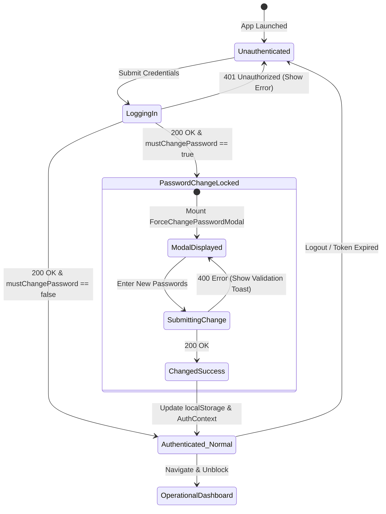

# Data Model: Frontend Cloud Deployment & API Integration (016-frontend-deployment)

## Overview
This document specifies the client-side domain entities, authentication structures, and environment configuration models required to connect and operate the RetailOS React frontend with the production cloud backend.

---

## 1. Client-Side Authentication Models

### `User`
Represents the authenticated retail operator profile stored in browser session state.

| Field | Type | Description | Required | Validation / Constraints |
|---|---|---|---|---|
| `id` | `string` (UUID) | Unique user identifier | Yes | Valid UUID |
| `email` | `string` | User login email address | Yes | Valid email format |
| `firstName` | `string` | User first name (Arabic/English) | Yes | 1-100 characters |
| `lastName` | `string` | User last name | Yes | 1-100 characters |
| `role` | `UserRole` | Operational system role | Yes | `'Owner' \| 'Manager' \| 'Cashier' \| 'InventoryClerk' \| 'Merchant'` |
| `storeId` | `string` (UUID) | Tenant identifier for active store | Yes | Valid UUID |
| `storeName` | `string` | Commercial display name of the store | Yes | 1-200 characters |
| `mustChangePassword` | `boolean` | Flag enforcing first-login password update | Yes (default: `false`) | Derived from JWT claims / API response |

### `AuthResponse`
The authentication payload received upon successful login or token refresh.

| Field | Type | Description | Required | Constraints |
|---|---|---|---|---|
| `accessToken` | `string` | Signed JWT Bearer token | Yes | Compact JWS format |
| `refreshToken` | `string` | Refresh token for background renewal | Yes | Non-empty token string |
| `expiresIn` | `number` | Access token lifespan in seconds | Yes | Positive integer (e.g. 3600) |
| `user` | `User` | Hydrated user entity | Yes | Non-null |

### `ChangePasswordRequest`
Payload submitted when modifying default or current password.

| Field | Type | Description | Required | Validation Rules |
|---|---|---|---|---|
| `currentPassword` | `string` | Current temporary or existing password | Yes | Non-empty |
| `newPassword` | `string` | Chosen new secure password | Yes | Minimum 8 chars, 1 uppercase, 1 lowercase, 1 number, 1 special symbol |
| `confirmPassword` | `string` | Client-side confirmation check | Yes | Must match `newPassword` |

---

## 2. Environment & Hosting Configuration Models

### `EnvironmentConfig`
Vite build-time configuration injected via `.env.production`.

| Key | Type | Default Value | Description |
|---|---|---|---|
| `VITE_API_URL` | `string` | `https://khedrfarrag-001-site1.itempurl.com/api/v1` | Canonical base URL for all HTTP endpoints |

### `HostingManifest`
Hosting rules for static web servers delivering the React SPA.

| Platform | File | Primary Configuration | Purpose |
|---|---|---|---|
| **Netlify** | `public/_redirects` & `netlify.toml` | `/* /index.html 200` | Redirects all deep paths to `index.html` with 200 status |
| **Vercel** | `vercel.json` | Rewrites `/(.*)` to `/index.html` | Fallback routing for SPA deep routes |
| **IIS / SmarterASP** | `web.config` | URL Rewrite rule: match `.*`, negate files/dirs, rewrite to `/index.html` | Prevents 404 on deep refresh when hosted in IIS `wwwroot` |

---

## 3. State Transitions: User Authentication & Password Gating

