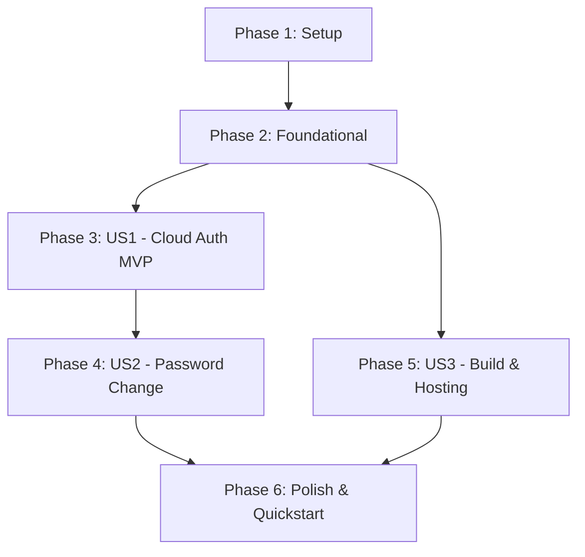

# Tasks: Frontend Cloud Deployment & API Integration (016-frontend-deployment)

**Feature**: `016-frontend-deployment`  
**Input**: [specs/016-frontend-deployment/spec.md](file:///g:/system-analysiss-saas/system-BE/specs/016-frontend-deployment/spec.md), [specs/016-frontend-deployment/plan.md](file:///g:/system-analysiss-saas/system-BE/specs/016-frontend-deployment/plan.md)  
**Status**: Completed (18/18 tasks verified)

---

## Phase 1: Setup (Shared Infrastructure)

**Purpose**: Environment and hosting configurations for production build and cloud routing.

- [X] T001 Initialize production environment configuration in `g:\system-analysiss-saas\system-FE\.env.production`
- [X] T002 [P] Configure Netlify redirect and cache headers in `g:\system-analysiss-saas\system-FE\public\_redirects` and `g:\system-analysiss-saas\system-FE\netlify.toml`
- [X] T003 [P] Configure Vercel rewrite rules for SPA deep routing in `g:\system-analysiss-saas\system-FE\vercel.json`

---

## Phase 2: Foundational (Blocking Prerequisites)

**Purpose**: Core TypeScript types, Axios interceptor, and AuthContext state that MUST be complete before user story flows.

**⚠️ CRITICAL**: No user story work can begin until this phase is complete.

- [X] T004 Extend user identity model with `mustChangePassword?: boolean` in `g:\system-analysiss-saas\system-FE\src\types\index.ts`
- [X] T005 Verify and update Axios client with production base URL and network error toast handling in `g:\system-analysiss-saas\system-FE\src\api\client.ts`
- [X] T006 Update `AuthContext.tsx` to manage `mustChangePassword` state, persistent storage, and password update handler in `g:\system-analysiss-saas\system-FE\src\context\AuthContext.tsx`

**Checkpoint**: Foundation ready - User Story implementation can proceed.

---

## Phase 3: User Story 1 - Seamless Cloud API Integration & Authentication (Priority: P1) 🎯 MVP

**Goal**: Connect the React web application to the remote live cloud backend (`https://khedrfarrag-001-site1.itempurl.com/api/v1`), authenticate users, store JWT credentials, and redirect to the dashboard.

**Independent Test**: Run app with `.env.production`; log in using `owner@retailos.com`; confirm authentication succeeds, JWT token is stored, user profile and store context are retrieved, and dashboard loads in under 2 seconds.

- [X] T007 [US1] Update `Login.tsx` to handle live cloud responses, Arabic error notifications, and loading state in `g:\system-analysiss-saas\system-FE\src\pages\Login.tsx`
- [X] T008 [US1] Ensure `ProtectedRoute.tsx` verifies active JWT token and redirects unauthenticated users to `/login` in `g:\system-analysiss-saas\system-FE\src\routes\ProtectedRoute.tsx`
- [X] T009 [US1] Execute live cloud API handshake test script against `https://khedrfarrag-001-site1.itempurl.com/api/v1/auth/login` to confirm credentials and payload schema

**Checkpoint**: User Story 1 is fully functional and independently verified.

---

## Phase 4: User Story 2 - Mandatory First-Login Password Change Flow (Priority: P1)

**Goal**: Present a mandatory, non-dismissible password change modal when `mustChangePassword` is `true`, preventing store navigation until updated via `POST /api/v1/auth/change-password`.

**Independent Test**: Log in with temporary credentials (`RetailOS@Prod2026!`); verify the modal opens automatically, enter new compliant password, confirm successful update, and verify normal store navigation unlocks.

- [X] T010 [US2] Implement `changePassword` API client call in `g:\system-analysiss-saas\system-FE\src\api\client.ts`
- [X] T011 [US2] Create `ForceChangePasswordModal.tsx` with Zod validation, Arabic error messages, and non-dismissible backdrop in `g:\system-analysiss-saas\system-FE\src\components\auth\ForceChangePasswordModal.tsx`
- [X] T012 [US2] Mount and gate `ForceChangePasswordModal` inside `Layout.tsx` whenever `user?.mustChangePassword === true` in `g:\system-analysiss-saas\system-FE\src\components\layout\Layout.tsx`

**Checkpoint**: User Stories 1 AND 2 are functional and verified.

---

## Phase 5: User Story 3 - Production Static Asset Optimization & Hosting Delivery (Priority: P2)

**Goal**: Build an optimized, code-split production bundle (< 350 KB gzip) with zero 404 errors on deep SPA route refreshes.

**Independent Test**: Run `npm run build` and `npm run preview`; directly load and refresh `/pos`, `/inventory`, and `/reports`; verify instant load (< 1.5s FCP) and no 404 errors.

- [X] T013 [P] [US3] Configure Rollup vendor chunk splitting in `g:\system-analysiss-saas\system-FE\vite.config.ts`
- [X] T014 [US3] Run production build (`npm run build`) in `g:\system-analysiss-saas\system-FE` and verify zero TypeScript errors and bundle size compliance
- [X] T015 [US3] Verify deep route refreshes on preview server across `/pos`, `/inventory`, and `/reports` to ensure zero 404 errors

---

## Phase 6: Polish & Cross-Cutting Concerns

**Purpose**: Localization, edge-case styling, end-to-end quickstart validation, and documentation.

- [X] T016 [P] Verify Arabic RTL alignment and responsive layout across desktop and tablet viewports in `g:\system-analysiss-saas\system-FE\src\index.css`
- [X] T017 Execute full validation scenarios from `specs/016-frontend-deployment/quickstart.md`
- [X] T018 Document production deployment instructions and verification summary in `specs/016-frontend-deployment/walkthrough.md`

---

## Dependencies & Execution Order

### Phase Dependencies

### Within Each Phase
- Foundation tasks (`T004`, `T005`, `T006`) must complete before UI and modal integration.
- In US2: `T010` (API) → `T011` (Modal Component) → `T012` (Layout Mounting).
- In US3: `T013` (Config) → `T014` (Build) → `T015` (Route verification).

### Parallel Opportunities
- Setup: `T002` (Netlify) and `T003` (Vercel) can run in parallel with `T001`.
- Phase 5: `T013` (Rollup config) can be prepared in parallel.
- Polish: `T016` (RTL styling) can run in parallel with documentation.

---

## Implementation Strategy

### MVP First (User Story 1 Only)
1. Complete Phase 1: Setup (`.env.production`, hosting configs).
2. Complete Phase 2: Foundational (Types, Axios client, AuthContext).
3. Complete Phase 3: User Story 1 (`Login.tsx`, live handshake test).
4. **STOP and VALIDATE**: Confirm login against remote backend.

### Incremental Delivery
1. Add User Story 2 (Password change modal) → Validate first-login flow.
2. Add User Story 3 (Vite build optimization & SPA routes) → Validate production preview.
3. Polish & run end-to-end quickstart guide.
